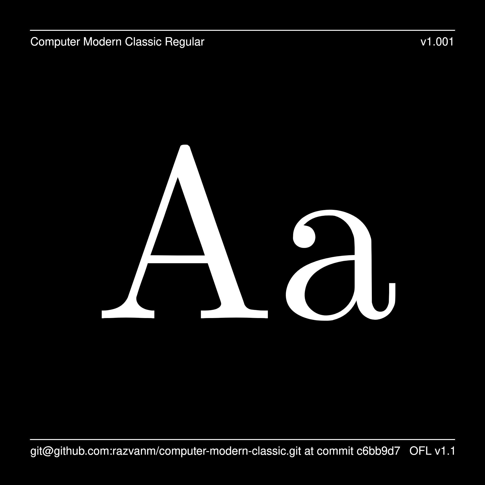
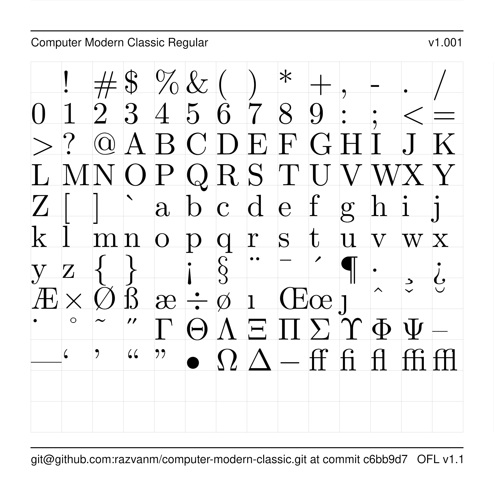

# Computer Modern Classic

[![][Fontbakery]](https://razvanm.github.io/computer-modern-classic/fontbakery/fontbakery-report.html)
[![][Universal]](https://razvanm.github.io/computer-modern-classic/fontbakery/fontbakery-report.html)
[![][GF Profile]](https://razvanm.github.io/computer-modern-classic/fontbakery/fontbakery-report.html)
[![][Outline Correctness]](https://razvanm.github.io/computer-modern-classic/fontbakery/fontbakery-report.html)
[![][Shaping]](https://razvanm.github.io/computer-modern-classic/fontbakery/fontbakery-report.html)

[Fontbakery]: https://img.shields.io/endpoint?url=https%3A%2F%2Fraw.githubusercontent.com%2Frazvanm%2Fcomputer-modern-classic%2Fgh-pages%2Fbadges%2Foverall.json
[GF Profile]: https://img.shields.io/endpoint?url=https%3A%2F%2Fraw.githubusercontent.com%2Frazvanm%2Fcomputer-modern-classic%2Fgh-pages%2Fbadges%2FGoogleFonts.json
[Outline Correctness]: https://img.shields.io/endpoint?url=https%3A%2F%2Fraw.githubusercontent.com%2Frazvanm%2Fcomputer-modern-classic%2Fgh-pages%2Fbadges%2FOutlineCorrectnessChecks.json
[Shaping]: https://img.shields.io/endpoint?url=https%3A%2F%2Fraw.githubusercontent.com%2Frazvanm%2Fcomputer-modern-classic%2Fgh-pages%2Fbadges%2FShapingChecks.json
[Universal]: https://img.shields.io/endpoint?url=https%3A%2F%2Fraw.githubusercontent.com%2Frazvanm%2Fcomputer-modern-classic%2Fgh-pages%2Fbadges%2FUniversal.json

**Computer Modern Classic** is an attempt to create a Computer Modern font that

1. is built from Donald Knuth's METAPOST fonts in a reproducible way
2. would pass the checks for being included in the Google Fonts.

One consequence of the first requirement is that the font will have, at least
for now, far less characters than other Computer Modern fonts.

## About

I'm currently working for Google but this is an independent project.

## Building

Fonts are built automatically by GitHub Actions - take a look in the "Actions"
tab for the latest build.

If you want to build fonts manually on your own computer:

* `make build` will produce font files.
* `make test` will run [FontBakery](https://github.com/googlefonts/fontbakery)'s
  quality assurance tests.
* `make proof` will generate HTML proof files.

The proof files and QA tests are also available automatically via GitHub
Actions - look at https://razvanm.github.io/computer-modern-classic.

## Changelog

**3 July 2023. Version 1.001**
- Initial release with only two styles: Regular (140 characters) and Italic (129
  characters).

## License

This Font Software is licensed under the SIL Open Font License, Version 1.1.
This license is available with a FAQ at
https://scripts.sil.org/OFL

## Repository Layout

This font repository structure is inspired by [Unified Font Repository
v0.3](https://github.com/unified-font-repository/Unified-Font-Repository),
modified for the Google Fonts workflow.
